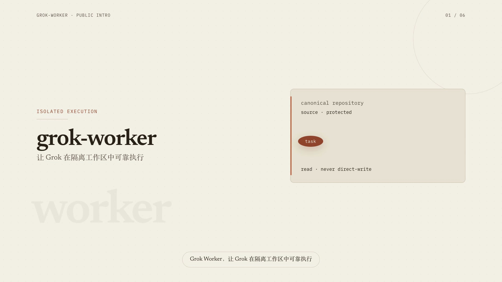

# codex-grok-orchestrator

**[中文](README.zh-CN.md)** · **[English](#english)**

Public repository name: **`codex-grok-orchestrator`**
Python package and CLI name (unchanged): **`grok-worker`**

[](docs/assets/grok-worker-intro-zh-final.mp4)

| | |
|---|---|
| **Landing page** | [https://maxxxdong.github.io/codex-grok-orchestrator/](https://maxxxdong.github.io/codex-grok-orchestrator/) |
| **Source** | [https://github.com/MaxxxDong/codex-grok-orchestrator](https://github.com/MaxxxDong/codex-grok-orchestrator) |
| **Intro video** | [docs/assets/grok-worker-intro-zh-final.mp4](docs/assets/grok-worker-intro-zh-final.mp4) |
| **Release notes** | [docs/releases/release-notes.md](docs/releases/release-notes.md) |
| **License** | Apache-2.0 |

### Latest update — 2026-07-20

`grok-worker` **0.7.0** focuses on faster repeated repository work without
weakening High-reasoning enforcement, isolation, cleanup, or lifecycle truth:
bounded execution contracts (targets, focused checks, risk-expanded final
gates), native same-task continuation, stable prompt fingerprints with honest
cache A/B metrics, opt-in pure-code tool policy, productive-progress attention,
and runner-owned native JSON Schema final-result capture. **0.6.1** tightened
CLI/metrics/efficiency guidance; **0.6.0** made detached event-first
`run --detach` + `watch` the Codex default. See the
[release notes](docs/releases/release-notes.md) and
[Windows/WSL upgrade guide](docs/windows-upgrade.md).

### Version history / 版本演进

| Version | Main update / 核心更新 |
|---|---|
| [`0.7.0`](https://github.com/MaxxxDong/codex-grok-orchestrator/releases/tag/v0.7.0) | Execution contracts, native continuation, JSON Schema result capture, tool policy, productive progress, cache fingerprints. / 执行契约、原生续跑、JSON Schema 结果落盘、工具策略、有效进展与缓存指纹。 |
| [`0.6.1`](https://github.com/MaxxxDong/codex-grok-orchestrator/releases/tag/v0.6.1) | CLI compatibility, honest cache/model-call metrics, monotonic process timing, and tighter execution-efficiency guidance. / CLI 兼容、诚实缓存与模型调用指标、单调运行计时及执行提效规则。 |
| [`0.6.0`](https://github.com/MaxxxDong/codex-grok-orchestrator/releases/tag/v0.6.0) | Detached launch, event-first `watch`, immediate attention signals, and bounded launcher logs. / 分离启动、事件优先等待、即时异常通知及有界启动日志。 |
| [`0.5.3`](https://github.com/MaxxxDong/codex-grok-orchestrator/releases/tag/v0.5.3) | Terminal/settled/attention notifications and one-pass disclosure preflight. / 终态、清理、介入通知与一次性外发预检。 |
| [`0.5.2`](https://github.com/MaxxxDong/codex-grok-orchestrator/releases/tag/v0.5.2) | Native Headless became the one-shot default while normal Grok plugins, MCP, OAuth, High reasoning, and shared caches stayed available. / 原生 Headless 成为一次性任务默认路径，同时保留正常插件、MCP、OAuth、High 推理与共享缓存。 |
| [`0.5.1`](https://github.com/MaxxxDong/codex-grok-orchestrator/releases/tag/v0.5.1) | Fixed native sandbox cache permissions and added a stable version command. / 修复原生沙箱缓存权限并加入稳定版本命令。 |
| [`0.5.0`](https://github.com/MaxxxDong/codex-grok-orchestrator/releases/tag/v0.5.0) | Added native Grok Build execution, automatic safe dirty snapshots, High-reasoning enforcement, and native usage metrics. / 新增原生 Grok Build、安全脏文件快照、High 推理强制与原生用量指标。 |
| [`0.4.2`](https://github.com/MaxxxDong/codex-grok-orchestrator/releases/tag/v0.4.2) | Replaced fixed startup lifetimes with activity-renewed, runtime-adjustable leases. / 用可动态调整、按活动续期的租约取代启动时固定寿命。 |
| `0.4.1` | Added managed isolated Grok profiles and fail-closed extension inspection. / 新增托管隔离 Grok Profile 与严格扩展检查。 |
| `0.4.0` | Added per-dispatcher capacity up to 10, completion events, disclosure gates, and bounded subagents. / 新增单调度器最多 10 路容量、完成事件、外发门禁及有界子代理。 |
| `0.3.0` | Initial standalone public release with installable CLIs, lifecycle documentation, and bilingual guidance. / 首个独立公开版，提供可安装 CLI、生命周期文档与双语指南。 |

Detailed behavior and verification for every release are kept in
[release notes](docs/releases/release-notes.md) and [CHANGELOG.md](CHANGELOG.md).

---

## 中文

### 这是什么

**codex-grok-orchestrator** 是一套开源的 **Codex × Grok 编排框架**：

- **Codex**（或其它上层 ACP 调度器）负责分发任务与审核结果
- **Grok** 作为 **隔离、生命周期托管** 的 Worker，在 disposable clone 中执行
- **证据**（三文件外部制品）决定结果是否可被接受

安装后的 Python 包与命令行仍为 **`grok-worker`**。本仓库不把调度器的私有策略伪装成公共引擎的硬锁。

### 这不是什么

它**不是**自动合并机器人，也**不会**：

- 自行合并代码、推送仓库、发布版本
- 提交比赛、表单或对外发布
- 保存服务商凭据、OAuth、代理或中转地址
- 用日志/通知伪造成功，或由 Worker 自行批准自己的工作

Worker 只负责执行与交付证据；是否合入始终由调度器或人工审核者决定。

### 架构

```text
调度器 (Codex / ACP)
        │  下发任务 + 权限配置
        ▼
   grok-worker CLI
        │  创建 disposable clone
        ▼
隔离克隆中的 Grok Worker（原生 Headless / ACP）
        │  lifecycle.json 为权威状态
        ▼
外部三文件制品 → 调度器审核 → 接受或拒绝
```

| 角色 | 职责 |
|---|---|
| 调度器 | 拆任务、设边界、审制品、决定合入 |
| `grok-worker` | 隔离执行、容量/缓存/GC、生命周期、制品契约 |
| Grok Worker | 在克隆内分析或实现，输出证据 |

### 核心原则

1. **先隔离再执行** — 源仓库始终是唯一真相源；Worker 只改 disposable clone。
2. **单一生命周期权威** — `.grok-worker/lifecycle.json` 是状态权威；进度与通知仅供观察。
3. **先证据后回收** — 成功克隆仅在三文件制品验证通过后才可回收。
4. **删除 fail-closed** — 路径与身份不明时保留，不猜测删除。
5. **权限是任务身份的一部分** — 命名会话的权限漂移必须新开会话。
6. **共享缓存有租约** — 活动环境不可被 GC 清掉。
7. **配置变更可回滚** — 原子替换 + 限时冒烟；失败逐字节恢复。
8. **审核与执行分离** — Worker 不合并、不推送、不发布、不自批。

完整不变量见 [设计原则](docs/design-principles.md)；运行语义见 [运维文档](docs/operations.md)。

### 平台支持

| 平台 | 状态 | 说明 |
|---|---|---|
| macOS | 支持 | 主要开发与验证平台 |
| Linux | 支持 | POSIX `flock` |
| Windows | 实验性 / 暂不支持原生运行 | 建议使用 WSL |

### 环境要求

- Python 3.12+
- Git
- `PATH` 中可用的 Grok Build CLI
- 仅 `--backend acp` 和命名会话需要兼容 ACP 的 `acpx` 客户端
- 已独立登录的 Grok CLI
- 源码启动器或共享依赖准备时需要 `uv`

凭据与中转配置**不**由本仓库保存。

### 安装

```bash
uv tool install --force "git+https://github.com/MaxxxDong/codex-grok-orchestrator.git@v0.7.0"
```

开发：

```bash
uv sync --extra dev
uv run pytest
```

源码启动器：`./bin/grok-worker`。

### 一次性任务

```bash
grok-worker status --source /path/to/repository --json

grok-worker run \
  --detach \
  --source /path/to/repository \
  --backend native \
  --mode analysis \
  --task-id public-release-audit \
  --prompt "检查打包、隐私与发布风险；不要修改文件。"
```

`run` 默认使用原生 Headless；Codex 调度时使用 `--detach`，启动回执返回后由
`watch` 等待事件，不再保持前台终端并每 10/30 秒轮询。直接交互或启动器诊断
仍可省略 `--detach`。需要旧通信层时显式传 `--backend acp`。实现任务使用
`--mode implementation`。普通 staged、unstaged、untracked 文件会经过敏感内容与软链接检查后自动快照；ignored 文件不会复制，疑似密钥与越界软链接仍拒绝启动。旧 `--include-dirty` / `--include-dirty-path` 只作兼容，不再是启动门槛，也不再过滤其他安全脏文件。

脏树包含测试 PAT、Bearer 或 API Key 形状时，可先运行
`grok-worker preflight --source /path/to/repository --json`。它一次返回所有
命中的相对路径与规则代码，不返回密钥值。等待任务时使用
`grok-worker watch --run-id <id> --wait-seconds 300 --json`：事件出现立即返回，
否则才给出一次紧凑健康心跳，避免调度器反复读取完整状态和日志。

脏树包含测试 PAT、Bearer 或 API Key 形状时，可先运行
`grok-worker preflight --source /path/to/repository --json`。它一次返回所有
命中的相对路径与规则代码，不返回密钥值。等待任务时使用
`grok-worker watch --run-id <id> --wait-seconds 300 --json`：事件出现立即返回，
否则才给出一次紧凑健康心跳，避免调度器反复读取完整状态和日志。

### 命名会话

任务清单需符合 [schemas/task-manifest.schema.json](schemas/task-manifest.schema.json)：

```bash
grok-worker session-start --source /path/to/repository --manifest-file task.json
grok-worker session-followup --source /path/to/repository --manifest-file followup.json
grok-worker session-finalize --source /path/to/repository --manifest-file final.json
```

命名会话在 0.5.x 仍使用 ACP。同一会话的任务 ID、源仓库、基线提交、角色、模式与权限签名必须一致。

### 证据契约

成功任务必须产出并验证外部三文件：

| 文件 | 含义 |
|---|---|
| `changes.patch` | 可审核、可重放的差异；只读任务可为有效空补丁 |
| `worker.log` | 生命周期、会话来源与完整 Agent 输出 |
| `verification.txt` | 结构化结果、验证记录、清理回执、指标与哈希 |

克隆内 `.grok-output/result.json` 会嵌入 `verification.txt`，**不是**第四个外部制品。失败与模糊运行会保留以便诊断。

### 安全边界

- 公共核心**允许**显式配置模型与推理强度；不要把私有调度策略说成全局硬锁。
- 稳定 Worker 提示词要求最多使用 3 个不重叠的并发子代理；runner 通过 `--no-subagents` 提供硬关闭，而数量上限由 Grok 遵守提示词策略。
- 删除与 GC 对源仓库、家目录、制品目录、共享缓存与 disposable 根目录保护。
- 个人路径、API Key、OAuth、代理/中转、在线 MCP、比赛 Gate 与组织审批链属于**私有叠加层**，不得进入公共核心。

### 文档

- [设计原则](docs/design-principles.md)
- [运维与失败语义](docs/operations.md)
- [Windows / WSL 0.3-0.5.3 → 0.7.0 升级](docs/windows-upgrade.md)
- [Skill 接入](SKILL.md)
- [发布说明](docs/releases/release-notes.md)
- [变更记录](CHANGELOG.md)
- [贡献指南](CONTRIBUTING.md) · [安全策略](SECURITY.md) · [发布检查表](RELEASE.md)
- [站点落地页](https://maxxxdong.github.io/codex-grok-orchestrator/) · [介绍视频](docs/assets/grok-worker-intro-zh-final.mp4)

### 致谢

公共边界参考了 [stdevMac/grok-in-codex](https://github.com/stdevMac/grok-in-codex) 的轻量接入思路，以及 [Cjbuilds/Codex-Orchestration](https://github.com/Cjbuilds/Codex-Orchestration) 的编排与发布纪律。**未复制上述项目的任何源代码。**

### 许可证

Apache License 2.0 — 见 [LICENSE](LICENSE)。

---

## English

### What it is

**codex-grok-orchestrator** is an open-source framework for **Codex × Grok orchestration**:

- **Codex** (or another ACP dispatcher) dispatches work and reviews outcomes
- **Grok** runs as an **isolated, lifecycle-managed** worker inside disposable clones
- **Evidence** (the three-file external artifact contract) decides whether results are accepted

The installable Python package and CLI remain **`grok-worker`**. The public engine permits explicit model and reasoning configuration; private dispatcher policy is not presented as a universal hard lock.

### What it is not

It is **not** an auto-merge bot. Workers **do not**:

- merge code, push repositories, or publish releases
- submit contests, forms, or external publications
- store provider credentials, OAuth state, proxies, or relay endpoints
- manufacture success from logs or notifications, or approve their own work

Workers execute and deliver evidence. Acceptance stays with the dispatcher or a human reviewer.

### Architecture

```text
Dispatcher (Codex / ACP)
        │  task + permission profile
        ▼
   grok-worker CLI
        │  disposable clone
        ▼
Isolated Grok worker (native headless / ACP)
        │  lifecycle.json is authoritative
        ▼
External three-file artifacts → review → accept or reject
```

| Role | Responsibility |
|---|---|
| Dispatcher | Scope work, set boundaries, review artifacts, decide integration |
| `grok-worker` | Isolation, capacity/cache/GC, lifecycle, artifact contract |
| Grok worker | Analyze or implement inside the clone; produce evidence |

### Distinctive principles

1. **Isolate before execution** — the source checkout stays canonical.
2. **One authoritative lifecycle** — `.grok-worker/lifecycle.json`; progress and notifications are advisory.
3. **Evidence before reclamation** — successful clones are reclaimed only after the three-file contract verifies.
4. **Deletion fails closed** — ambiguous paths are retained, never guessed away.
5. **Permissions are identity** — named-session drift requires a new session.
6. **Shared caches use leases** — active environments cannot be GC-evicted.
7. **Config changes are transactional** — atomic replace, bounded smoke, byte-exact rollback.
8. **Reviewer separation** — workers do not merge, push, publish, submit, or self-approve.

See [Design principles](docs/design-principles.md) and [Operations](docs/operations.md).

### Supported platforms

| Platform | Status | Notes |
|---|---|---|
| macOS | Supported | Primary development platform |
| Linux | Supported | POSIX `flock` |
| Windows | Experimental / unsupported natively | Prefer WSL |

### Requirements

- Python 3.12+
- Git
- Grok Build CLI on `PATH`
- An `acpx`-compatible client only for `--backend acp` and named sessions
- Grok CLI authenticated independently of this project
- `uv` when using the source-checkout launcher or shared dependency preparation

Provider login and credentials stay outside this repository.

### Install

```bash
uv tool install --force "git+https://github.com/MaxxxDong/codex-grok-orchestrator.git@v0.7.0"
```

Development:

```bash
uv sync --extra dev
uv run pytest
```

Source launcher: `./bin/grok-worker`.

### One-shot usage

```bash
grok-worker status --source /path/to/repository --json

grok-worker run \
  --detach \
  --source /path/to/repository \
  --backend native \
  --mode analysis \
  --task-id public-release-audit \
  --prompt "Audit packaging, privacy, and release readiness. Do not edit files."
```

`run` defaults to native headless. Codex dispatchers use `--detach`, then wait on
`watch` instead of keeping a foreground terminal and polling every 10/30 seconds.
Omit `--detach` only for direct interactive use or launcher diagnosis. Use
`--backend acp` only for compatibility and `--mode implementation` for edits.
Ordinary staged, unstaged, and untracked files are automatically snapshotted after sensitive-content and symlink checks. Ignored files are never copied; suspected secrets and escaping symlinks still block startup. Legacy dirty flags remain accepted but no longer filter other safe dirt.

### Named-session usage

Manifests must conform to [schemas/task-manifest.schema.json](schemas/task-manifest.schema.json):

```bash
grok-worker session-start --source /path/to/repository --manifest-file task.json
grok-worker session-followup --source /path/to/repository --manifest-file followup.json
grok-worker session-finalize --source /path/to/repository --manifest-file final.json
```

Named sessions remain ACP-backed in 0.5.x. Task ID, source repository, baseline commit, role, mode, and permission signature stay immutable for a session.

### Evidence contract

Successful tasks must produce and verify three external files:

| File | Meaning |
|---|---|
| `changes.patch` | Reviewable, replayable diff (valid empty patch for read-only work) |
| `worker.log` | Lifecycle, session provenance, and full agent output |
| `verification.txt` | Structured result, verification records, cleanup receipt, metrics, hashes |

Clone-local `.grok-output/result.json` is embedded into `verification.txt`; it is **not** a fourth external artifact. Failed and ambiguous runs are retained for diagnosis.

### Safety boundaries

- The public core **allows** explicit model and reasoning configuration.
- The stable Worker prompt asks for at most 3 non-overlapping concurrent subagents. The runner hard-disables subagents with `--no-subagents`; the numeric cap is prompt-enforced by Grok.
- Deletion and GC protect the source, home, artifact root, shared cache, and disposable root.
- Personal paths, API keys, OAuth, relays, live MCP, competition gates, and org approval chains belong in **private overlays**, not the public core.

### Documentation

- [Design principles](docs/design-principles.md)
- [Operations](docs/operations.md)
- [Windows / WSL 0.3-0.5.3 → 0.7.0 upgrade](docs/windows-upgrade.md)
- [Skill integration](SKILL.md)
- [Release notes](docs/releases/release-notes.md)
- [Changelog](CHANGELOG.md)
- [Contributing](CONTRIBUTING.md) · [Security](SECURITY.md) · [Release checklist](RELEASE.md)
- [Landing page](https://maxxxdong.github.io/codex-grok-orchestrator/) · [Intro video](docs/assets/grok-worker-intro-zh-final.mp4)

### Acknowledgements

The public boundary was informed by the thin integration approach in [stdevMac/grok-in-codex](https://github.com/stdevMac/grok-in-codex) and the orchestration/release discipline in [Cjbuilds/Codex-Orchestration](https://github.com/Cjbuilds/Codex-Orchestration). **No source code from either project is included.**

### License

Apache License 2.0. See [LICENSE](LICENSE).
